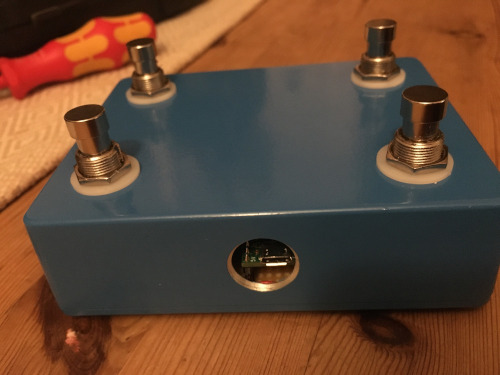
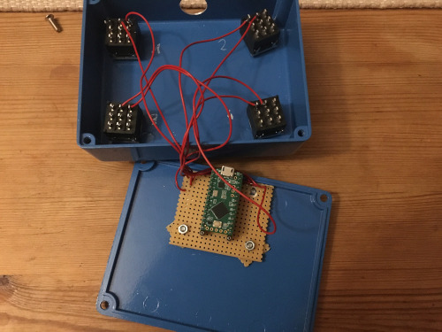

# Midi Stompbox

This stompbox sends MIDI messages via USB MIDI. 

It consists of

* Teensy LC Microcontroller
* 4 Stomp Box Footswitches
* An enclosure
* Some isolated wire
* Rubber feet

I use it to:

* Play electric guitar through my computer. Using the stompbox I can select change the programs, effects, ...
* Turn Ableton Live into a looper. Of course Ableton Live can loop also without the stompbox, but using this stompbox I can control the looper with my feet, having hands free for the instruments I want to loop.
* Send program change messages to my MPC using the stompbox to change sequences while using effects to make the sequence change more interesting.

The Source Code comes in two versions:

* **midistomp_note_on_off** sends midi notes 60, 61, 62 or 63 on midi channel 1.
* **midistomp_program_change** sends program change messages on midi channel 1. Using two stomps you can change to program 1-16. The programs are arranged in pages 1-4. Page 1 corresponds to programs 1-4, page 2 to programs 5-8, page 3 to programs 9-12 and page 4 to programs 13-16. First stomp selects the page, second stomp the midi program. So to select program 2, stomp 1 and 2. Program 13 is stomp 4 and 1. Etc... After selecting the page, you can select the program in one second.

## Electrical Wiring

Unfortunately I did not write down a schematic. It is powered via USB. You only need to connect the buttons in series to the Teensy input pins and ground. It uses the internal pullups. Connect these pins:

* button 1: teensy pin 2
* button 2: teensy pin 1
* button 3: teensy pin 4
* button 4: teensy pin 3

## Compiling the codes

I used Arduino IDE to compile the code and transfer it to the Teensy. 

* As for any Teensy based programs you need to install the Teensyduino Extension for Arduino IDE: https://www.pjrc.com/teensy/teensyduino.html
* Before building and uploding, select USB Type "Serial + Midi" in the Arduino IDE

## If I would build it again

* I would pay more for the stompbox switches. I bought them on Aliexpress and paid 2 Euro for 10 switches. They work but they make a super loud click. Next time I will buy super silent switches in a shop for DIY music electronics which cost around 2 Euro per switch.
* I would have spent more time on thinking about and measuring the position of the teensy board and the hole in the enclosure. Right now it fits somehow, but I would like the USB plug to be right in the middle of the hole. Or use a USB B Neutrik socket.
